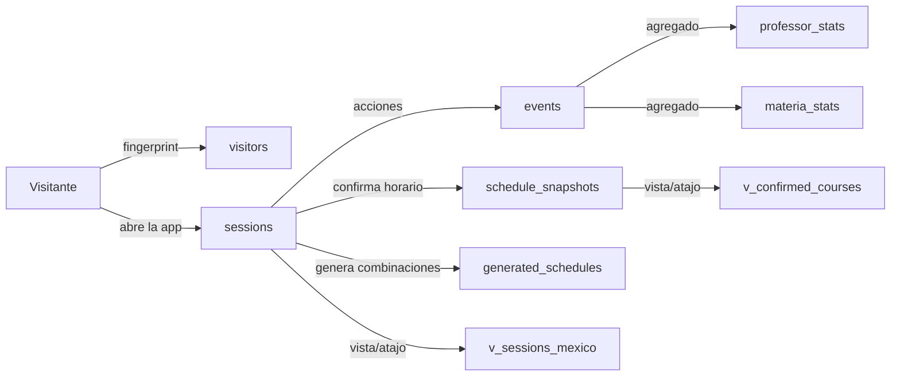
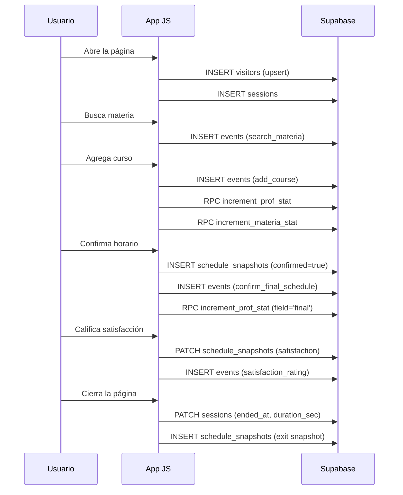

# SADA Analytics — Documentación del Esquema de Datos

> **Proyecto**: Generador de Horarios FACULTAD DE PSICOLOGÍA UNAM  
> **Base de datos**: Supabase (PostgreSQL)  
> **Proyecto ID**: `qxfsjplcehcjqmsquahz`  
> **Última actualización**: 15 de abril 2026

---

## Arquitectura General

---

## 1. Tablas Principales

### 1.1 `visitors` — Perfil anónimo del visitante

Identifica visitantes únicos sin datos personales. Un visitante puede tener múltiples sesiones.

| Campo | Tipo | Descripción |
|---|---|---|
| `id` | `UUID` | ID anónimo derivado del fingerprint del navegador |
| `fingerprint` | `text` | Hash único del navegador (user agent + pantalla + zona horaria) |
| `device_type` | `text` | `desktop` / `mobile` / `tablet` |
| `screen_width` | `int` | Ancho de pantalla en px |
| `screen_height` | `int` | Alto de pantalla en px |
| `user_agent` | `text` | Navegador y sistema operativo (máx 500 chars) |
| `timezone` | `text` | Zona horaria del usuario (ej: `America/Mexico_City`) |
| `language` | `text` | Idioma del navegador (ej: `es-MX`) |
| `last_seen` | `timestamptz` | Última vez que se conectó |
| `created_at` | `timestamptz` | Primera vez que se conectó (para retención) |

**Relaciones**: `1 visitor → N sessions`  
**RLS**: Habilitado — solo INSERT/UPDATE desde anon  
**Upsert**: Por `id` — si el visitante ya existe, solo actualiza `last_seen`

---

### 1.2 `sessions` — Sesión de uso

Cada vez que alguien abre la app se crea una sesión. Se cierra con `beforeunload`.

| Campo | Tipo | Descripción |
|---|---|---|
| `id` | `UUID` | ID de sesión (generado con `crypto.randomUUID()`) |
| `visitor_id` | `UUID` | FK → `visitors.id` |
| `referrer` | `text` | URL de origen (de dónde llegó) |
| `utm_source` | `text` | Parámetro de campaña (fuente) |
| `utm_medium` | `text` | Parámetro de campaña (medio) |
| `utm_campaign` | `text` | Parámetro de campaña (nombre) |
| `landing_page` | `text` | Página de entrada |
| `started_at` | `timestamptz` | Inicio de la sesión |
| `ended_at` | `timestamptz` | Cierre de la sesión |
| `duration_sec` | `int` | Duración total en segundos |
| `semester_used` | `text` | Semestre seleccionado (2, 4, 6, 8, adicional) |
| `mode_used` | `text[]` | Modos usados durante la sesión (`['manual', 'auto']`) |

**Relaciones**: `1 session → N events`, `1 session → N schedule_snapshots`  
**RLS**: Habilitado — INSERT/UPDATE desde anon

---

### 1.3 `events` — Registro de acciones del usuario

Transcurso de eventos que captura **cada acción** del usuario en la app. Es la tabla más nutrida

| Campo | Tipo | Descripción |
|---|---|---|
| `id` | `bigint` | ID autoincremental |
| `session_id` | `UUID` | FK → `sessions.id` |
| `visitor_id` | `UUID` | FK → `visitors.id` |
| `event_type` | `text` | Tipo de evento (ver catálogo abajo) |
| `event_data` | `JSONB` | Datos variables según el tipo de evento |
| `created_at` | `timestamptz` | Timestamp del evento |

**RLS**: Habilitado — solo INSERT desde anon

#### Catálogo de tipos de evento

| `event_type` | Datos en `event_data` | Cuándo se dispara |
|---|---|---|
| `enter_workspace` | `{semester}` | Al entrar desde la landing |
| `change_semester` | `{semester}` | Al cambiar el semestre en el selector |
| `change_mode` | `{mode}` | Al cambiar entre manual y auto |
| `search_materia` | `{query, results_count, mode}` | Al buscar en el buscador de materias |
| `add_course` | `{materia, clave, grupo, profesor, semestre, creditos}` | Al agregar un curso al horario (manual) |
| `remove_course` | `{materia, grupo, profesor}` | Al eliminar un curso |
| `add_to_bolsa` | `{materia, grupos_count, grupo, profesor, clave}` | Al agregar a la bolsa (auto) |
| `use_tool` | `{tool, ...extra}` | Al usar herramientas (undo, redo, recolor, visual, etc.) |
| `generate_combinations` | `{materias_count, materias, total_posibilidades, resultados_validos, tiempo_ms, cancelado}` | Al generar horarios en modo auto |
| `open_combination` | `{index, cursos[]}` | Al abrir una combinación generada |
| `export_schedule` | `{format, mode, materias_count, creditos_total}` | Al descargar (PDF, PNG, Excel, CSV) |
| `transfer_to_manual` | `{combination_index, materias_count, materias[]}` | Al transferir combinación auto → manual |
| `apply_filter` | `{filter_type, filter_value}` | Al usar filtros en modo auto |
| `sada_profile` | `{action, ...datos}` | Interacción con el perfil SADA |
| `confirm_final_schedule` | `{mode, semester, total_materias, total_creditos, cursos[]}` | Al presionar "Este es mi horario final" |
| `auto_snapshot` | `{mode, semester, cursos[]}` | Captura pasiva automática del estado |
| `consent` | `{accepted}` | Respuesta al banner de consentimiento |
| `satisfaction_rating` | `{rating}` | Calificación de satisfacción (1-5) |
| `ver_normativa` | `{mode}` | Al expandir las instrucciones |

---

### 1.4 `schedule_snapshots` — Horarios armados

**La tabla más valiosa.** Contiene el horario completo del usuario, con todas las materias, profesores y sesiones.

| Campo | Tipo | Descripción |
|---|---|---|
| `id` | `bigint` | ID autoincremental |
| `session_id` | `UUID` | FK → `sessions.id` |
| `visitor_id` | `UUID` | FK → `visitors.id` |
| `mode` | `text` | `manual` o `auto` |
| `semester` | `text` | Semestre seleccionado |
| `confirmed` | `boolean` | `true` = botón confirmado, `false` = captura automática |
| `cursos` | `JSONB` | Array de cursos con estructura: |
| | | `[{asignatura, profesor, grupo, clave, creditos, area, sesiones: [{dia, inicio, fin}]}]` |
| `total_creditos` | `int` | Suma de créditos |
| `total_materias` | `int` | Cantidad de materias |
| `actividades` | `JSONB` | Actividades extra: `[{nombre, sesiones: [{dia, inicio, fin}]}]` |
| `dias_asistencia` | `int` | Número de días con clase (calculado) |
| `hora_inicio_min` | `int` | Hora más temprana en minutos (ej: 420 = 7:00 AM) |
| `hora_fin_max` | `int` | Hora más tardía en minutos (ej: 840 = 2:00 PM) |
| `turno` | `text` | `matutino` (fin ≤ 14:00) / `vespertino` (inicio ≥ 13:00) / `mixto` |
| `satisfaction` | `int` | Calificación 1-5 (solo si el usuario respondió la encuesta) |
| `created_at` | `timestamptz` | Timestamp con zona horaria |

**RLS**: Habilitado — solo INSERT desde anon, UPDATE para satisfaction

---

### 1.5 `generated_schedules` — Generaciones del modo auto

Registra cada vez que el usuario genera combinaciones en modo Explorador.

| Campo | Tipo | Descripción |
|---|---|---|
| `id` | `bigint` | ID autoincremental |
| `session_id` | `UUID` | FK → `sessions.id` |
| `visitor_id` | `UUID` | FK → `visitors.id` |
| `mode` | `text` | Siempre `auto` |
| `semester` | `text` | Semestre |
| `materias` | `JSONB` | Nombres de materias incluidas |
| `total_creditos` | `int` | Créditos totales |
| `total_materias` | `int` | Cantidad de materias |
| `combinations_found` | `int` | Total combinaciones posibles sin traslape |
| `combinations_shown` | `int` | Combinaciones mostradas (máx 50) |
| `generation_time_ms` | `int` | Tiempo de cálculo en milisegundos |

**RLS**: Habilitado — solo INSERT desde anon

---

### 1.6 `professor_stats` — Ranking de profesores

Tabla de conteo rápido. Se actualiza vía función RPC (`increment_prof_stat`).

| Campo | Tipo | Descripción |
|---|---|---|
| `id` | `bigint` | ID autoincremental |
| `semester` | `text` | Semestre |
| `materia_name` | `text` | Nombre de la materia |
| `profesor` | `text` | Nombre del profesor |
| `grupo` | `text` | Grupo |
| `clave` | `text` | Clave de la materia |
| `times_selected` | `int` | Veces seleccionado (agregado al horario) |
| `times_in_final` | `int` | Veces en horario confirmado como final |
| `last_used` | `timestamptz` | Última vez que fue seleccionado |

**Constraint único**: `(semester, materia_name, profesor)`  
**RLS**: Habilitado — INSERT/UPDATE desde anon

---

### 1.7 `materia_stats` — Ranking de materias (agregado)

Similar a `professor_stats` pero a nivel materia.

| Campo | Tipo | Descripción |
|---|---|---|
| `id` | `bigint` | ID autoincremental |
| `semester` | `text` | Semestre |
| `materia_name` | `text` | Nombre de la materia |
| `clave` | `text` | Clave |
| `times_selected` | `int` | Veces seleccionada |
| `times_generated` | `int` | Veces incluida en generación auto |
| `times_exported` | `int` | Veces exportada en un horario |
| `last_used` | `timestamptz` | Última vez usada |

**RLS**: Habilitado — INSERT/UPDATE desde anon

---

## 2. Vistas (Solo accesibles desde Dashboard)

### 2.1 `v_confirmed_courses`

Desanida los horarios confirmados para hacer queries directas sin parsear JSONB.

| Campo | Fuente |
|---|---|
| `snapshot_id` | `schedule_snapshots.id` |
| `visitor_id` | del snapshot |
| `semester` | del snapshot |
| `mode` | manual / auto |
| `total_creditos` | del snapshot |
| `total_materias` | del snapshot |
| `dias_asistencia` | del snapshot |
| `turno` | del snapshot |
| `hora_inicio_min` | del snapshot |
| `hora_fin_max` | del snapshot |
| `fecha_mexico` | `created_at` convertido a hora México |
| `materia` | del JSONB desanidado |
| `profesor` | del JSONB desanidado |
| `grupo` | del JSONB desanidado |
| `clave` | del JSONB desanidado |
| `area` | del JSONB desanidado |
| `creditos` | del JSONB desanidado |

### 2.2 `v_sessions_mexico`

Sesiones con timestamps convertidos a hora México.

---

## 3. Funciones RPC

### `increment_prof_stat(p_semester, p_materia, p_profesor, p_grupo, p_clave, p_field)`
- **`p_field = 'selected'`**: Incrementa `times_selected`
- **`p_field = 'final'`**: Incrementa `times_in_final`
- Usa `SECURITY DEFINER` para bypass RLS

### `increment_materia_stat(p_semester, p_materia, p_clave, p_field)`
- Similar pero para materias

---

## 4. Flujo de datos

---

## 5. Propuestas de Queries para Análisis

### 5.1 Análisis Descriptivo

#### Top 10 profesores más elegidos en horarios finales

#### Top materias más populares por semestre

#### Distribución de turno preferido

#### Promedio de satisfacción por semestre

---

### 5.2 Análisis de Comportamiento

#### Modo preferido (manual vs auto)

#### Tasa de confirmación (embudo)

#### Herramientas más usadas

#### Tiempo promedio de sesión por modo

#### Materias más eliminadas (indecisión)

---

### 5.3 Análisis de Dispositivos

#### Distribución por dispositivo

#### Tasa de completado por dispositivo

---

### 5.4 Queries para posible Regresión

#### Dataset para regresión: satisfacción ~ variables

#### Dataset para regresión: duración ~ complejidad

---

### 5.5 Queries para Probabilidad

#### P(elegir profesor X | materia Y)

#### P(confirmar | modo)

#### P(turno matutino | semestre)

---

### 5.6 Comparaciones

#### Manual vs Auto: engagement y resultados

#### Semestre 2 vs 4 vs 6 vs 8: complejidad de horarios

#### Áreas más elegidas por semestre

---

## 6. Seguridad

| Elemento | Estado |
|---|---|
| RLS en todas las tablas | Habilitado |
| Políticas: solo INSERT/UPDATE desde anon | Configurado |
| SELECT/DELETE bloqueados para anon | Bloqueado |
| Vistas bloqueadas para API | `REVOKE ALL ON ... FROM anon` |
| Funciones RPC con SECURITY DEFINER | Para bypass RLS controlado |
| Datos personales | No se recopilan (solo fingerprint anónimo) |
| Consentimiento | Disclaimer informativo al primer uso |

---

## 7. Notas Técnicas

### Timezone
- Los timestamps se envían con offset de zona horaria (ej: `2026-04-16T08:30:00-06:00`)
- Supabase almacena en UTC internamente
- Las vistas `v_confirmed_courses` y `v_sessions_mexico` convierten a `America/Mexico_City`
- La base de datos tiene `timezone = 'America/Mexico_City'` como default

### Rendimiento
- Índices en `schedule_snapshots`: por `visitor_id` y `confirmed`
- Índices en `professor_stats`: por `semester`
- Events insertan en batch (cola de máx 50, flush cada 10s)
- `keepalive: true` en requests de cierre de sesión

### Retención de datos
- `professor_stats` y `materia_stats` son derivables de `events` + `schedule_snapshots`
- Si se pierden, se pueden regenerar con queries de agregación
